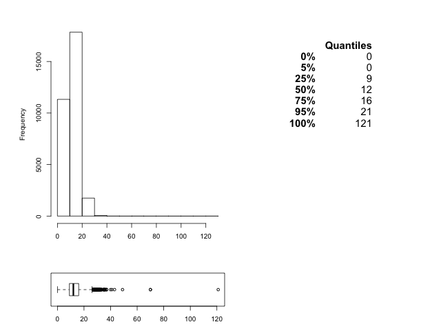
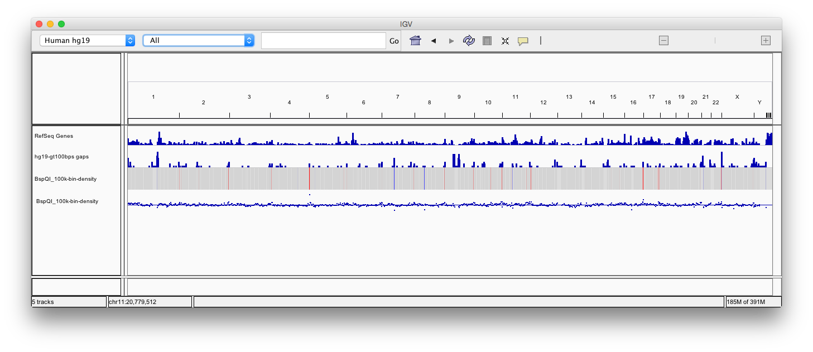
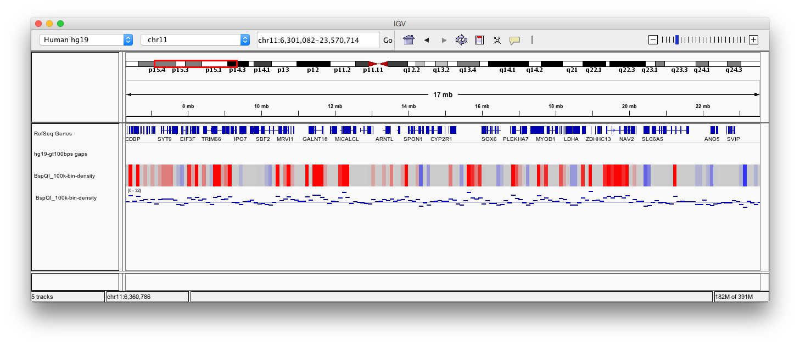

Applying the labeldensity.pl script to the human genome (hg19)
==========

This script looks for label occurences across a reference genome and computes the label density in bins of a user-provided size. 
It also produced BED and IGV files allowing IGV visualization. 

In the example below, the human reference genome was searched for Nt.BspQI sites and the density in 100knb bins computed and vizualized in IGV. Additional tracks for N-regions (aka gaps) is added. A random region was selected to show a zoomed view (chr4:1,486,940-16,191,114) and colors were adapted from the quantile distribution of the densities in ordee to ieasily identify regions of under-laelling (0-25% quantile Q1) or over-labelling (75-100% quantile Q3). A second copy og the same rtack was added in point mode with a lgne showing the median labelling.

The command used to create the BspQI track was:

```
labeldensity.pl -i hg19.fa -t BspQI-density -l 20000 -b 100000 -n 'GCTCTTC'
```

The distribution of BspQI densities across the human genome (hg19) is computed and potted by the script. Please note the values for 25, 50, and 75% which will be used later on for color and lines in IGV.

 

Tracks were added to display human genes, as well as human Gasps (N-regions) and the density track created by labeldensity.pl



The colors for the heatmap view were taken from the quantiles in the above plot. The horizontal lin ein the lower plot corresponds to the median value of the distribution.


A zoomed region in chr4 shows a concentration of over-labelling (red color).



<h4>Please send comments and feedback to <a href="mailto:nucleomics.bioinformatics@vib.be">nucleomics.bioinformatics@vib.be</a></h4>

------------


This work is licensed under a [Creative Commons Attribution-ShareAlike 3.0 Unported License](http://creativecommons.org/licenses/by-sa/3.0/).
