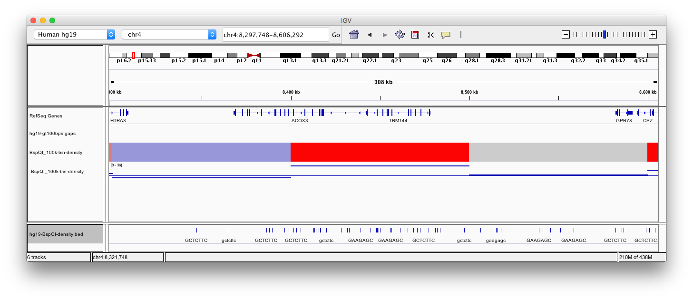

Applying the labeldensity.pl script to the human genome (hg19)
==========

This script looks for label occurences across a reference genome and computes the label density in bins of a user-provided size. 
It also produced BED and IGV files allowing IGV visualization. 

In the example below, the human reference genome was searched for Nt.BspQI sites (both strands) and the density in 100knb bins computed for vizualization in IGV. A random region was selected to show a zoomed view (chr4:1,486,940-16,191,114) and colors were adapted from the quantile distribution of the densities in ordee to ieasily identify regions of under-laelling (0-25% quantile Q1) or over-labelling (75-100% quantile Q3). A second copy og the same track was added in point mode with a ligne showing the median labelling. A additional tracks for N-regions (aka gaps) was added (made with the script [fastaFindGaps.pl](https://github.com/BITS-VIB/ngs-tools/blob/master/fasta-tools/fastaFindGaps.pl)). 

The command used to create the Nt.BspQI track was:

```
labeldensity.pl -i hg19.fa -t BspQI-density -l 20000 -b 100000 -n 'GCTCTTC'
```

The distribution of BspQI densities across the human genome (hg19) is computed and plotted by the script. Please note the values for 25%, 50%, and 75% which will be used later on for the colors and median line in IGV.

 

The density track created by labeldensity.pl was added twice in IGV next to the standard human genes track, and the human Gaps (N-regions). One copy of the track was shown as heatmap and the second copy as dots.


The colors for the heatmap view were taken from the quantiles in the above plot. The horizontal line in the lower plot corresponds to the median value of the distribution.


A zoomed region in chr4 shows a concentration of over-labelling (red color).


Users can estimate biases and locate potential fragile sites when the additional raw label data track is added and zoom is set high enough.



<h4>Please send comments and feedback to <a href="mailto:nucleomics.bioinformatics@vib.be">nucleomics.bioinformatics@vib.be</a></h4>

------------


This work is licensed under a [Creative Commons Attribution-ShareAlike 3.0 Unported License](http://creativecommons.org/licenses/by-sa/3.0/).
