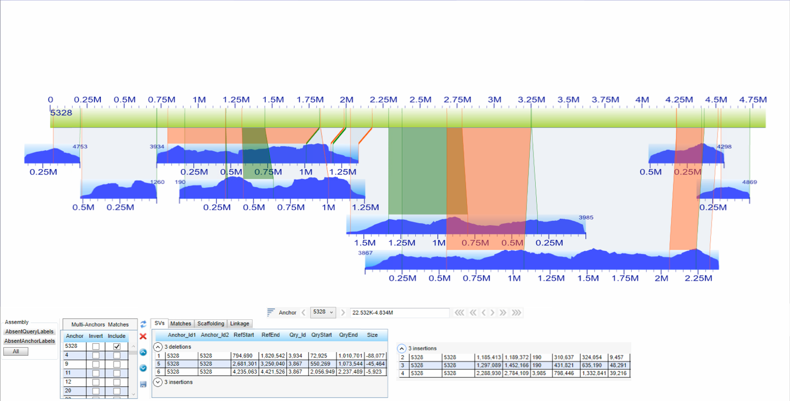
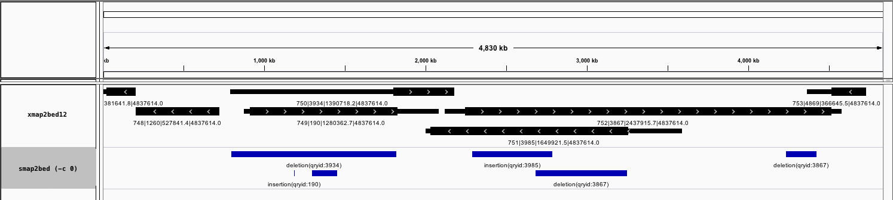

Applying the smap2bed.pl scripts to a smap sample data
==========

REM: Since I made this script and page, BNG released a tool to convert smap to VCF. Please find it on their GitHub (https://github.com/bionanogenomics)

A test data was extracted from some smap file generated with Irys as well as the graphical representation of all cmaps aligning to the test scaffold.

After convertion and loading in IGV, the top track shows the BED12 export where thiner blocks represent regions of the query that do not align to the reference. The thicker blocks in both tracks represent the region of the reference that is matched in the query cmap (but differences in size within this region are not represented). Confidence filtering is also possible with the optionnal parameter '-x'.

The second track was generated with **smap2bed.pl** for only calls with score >0 (more complex calls are not garantied true with version 1.1 of smap2bed).

**The original smap data**

<table>
  <tr>
    <th class="tg-yw4l">SmapEntryID</th>
    <th class="tg-yw4l">QryContigID</th>
    <th class="tg-yw4l">RefcontigID1</th>
    <th class="tg-yw4l">RefcontigID2</th>
    <th class="tg-yw4l">QryStartPos</th>
    <th class="tg-yw4l">QryEndPos</th>
    <th class="tg-yw4l">RefStartPos</th>
    <th class="tg-yw4l">RefEndPos</th>
    <th class="tg-yw4l">Confidence</th>
    <th class="tg-yw4l">Type</th>
    <th class="tg-yw4l">XmapID1</th>
    <th class="tg-yw4l">XmapID2</th>
    <th class="tg-yw4l">LinkID</th>
    <th class="tg-yw4l">QryStartIdx</th>
    <th class="tg-yw4l">QryEndIdx</th>
    <th class="tg-yw4l">RefStartIdx</th>
    <th class="tg-yw4l">RefEndIdx</th>
  </tr>
  <tr>
    <td class="tg-yw4l">266</td>
    <td class="tg-yw4l">190</td>
    <td class="tg-yw4l">455</td>
    <td class="tg-yw4l">5328</td>
    <td class="tg-yw4l">1036342.0</td>
    <td class="tg-yw4l">1007949.4</td>
    <td class="tg-yw4l">23933.0</td>
    <td class="tg-yw4l">1827960.0</td>
    <td class="tg-yw4l">-1.00</td>
    <td class="tg-yw4l">translocation_interchr</td>
    <td class="tg-yw4l">294</td>
    <td class="tg-yw4l">3052</td>
    <td class="tg-yw4l">-1</td>
    <td class="tg-yw4l">93</td>
    <td class="tg-yw4l">92</td>
    <td class="tg-yw4l">1</td>
    <td class="tg-yw4l">163</td>
  </tr>
  <tr>
    <td class="tg-yw4l">323</td>
    <td class="tg-yw4l">4869</td>
    <td class="tg-yw4l">565</td>
    <td class="tg-yw4l">5328</td>
    <td class="tg-yw4l">212497.0</td>
    <td class="tg-yw4l">192944.7</td>
    <td class="tg-yw4l">602227.0</td>
    <td class="tg-yw4l">4534875.0</td>
    <td class="tg-yw4l">-1.00</td>
    <td class="tg-yw4l">translocation_interchr</td>
    <td class="tg-yw4l">346</td>
    <td class="tg-yw4l">3061</td>
    <td class="tg-yw4l">-1</td>
    <td class="tg-yw4l">16</td>
    <td class="tg-yw4l">15</td>
    <td class="tg-yw4l">55</td>
    <td class="tg-yw4l">422</td>
  </tr>
  <tr>
    <td class="tg-yw4l">1267</td>
    <td class="tg-yw4l">3934</td>
    <td class="tg-yw4l">2883</td>
    <td class="tg-yw4l">5328</td>
    <td class="tg-yw4l">80511.4</td>
    <td class="tg-yw4l">72925.3</td>
    <td class="tg-yw4l">173155.0</td>
    <td class="tg-yw4l">794690.0</td>
    <td class="tg-yw4l">-1.00</td>
    <td class="tg-yw4l">translocation_interchr</td>
    <td class="tg-yw4l">1735</td>
    <td class="tg-yw4l">3049</td>
    <td class="tg-yw4l">-1</td>
    <td class="tg-yw4l">10</td>
    <td class="tg-yw4l">9</td>
    <td class="tg-yw4l">22</td>
    <td class="tg-yw4l">69</td>
  </tr>
  <tr>
    <td class="tg-yw4l">1534</td>
    <td class="tg-yw4l">3985</td>
    <td class="tg-yw4l">3617</td>
    <td class="tg-yw4l">5328</td>
    <td class="tg-yw4l">1104153.3</td>
    <td class="tg-yw4l">1332841.3</td>
    <td class="tg-yw4l">9099.0</td>
    <td class="tg-yw4l">2288930.0</td>
    <td class="tg-yw4l">-1.00</td>
    <td class="tg-yw4l">translocation_interchr</td>
    <td class="tg-yw4l">2197</td>
    <td class="tg-yw4l">3055</td>
    <td class="tg-yw4l">-1</td>
    <td class="tg-yw4l">112</td>
    <td class="tg-yw4l">127</td>
    <td class="tg-yw4l">1</td>
    <td class="tg-yw4l">201</td>
  </tr>
  <tr>
    <td class="tg-yw4l">1535</td>
    <td class="tg-yw4l">3985</td>
    <td class="tg-yw4l">3617</td>
    <td class="tg-yw4l">5328</td>
    <td class="tg-yw4l">1019941.4</td>
    <td class="tg-yw4l">798446.1</td>
    <td class="tg-yw4l">93644.0</td>
    <td class="tg-yw4l">2784109.0</td>
    <td class="tg-yw4l">-1.00</td>
    <td class="tg-yw4l">translocation_interchr</td>
    <td class="tg-yw4l">2197</td>
    <td class="tg-yw4l">3057</td>
    <td class="tg-yw4l">-1</td>
    <td class="tg-yw4l">103</td>
    <td class="tg-yw4l">79</td>
    <td class="tg-yw4l">10</td>
    <td class="tg-yw4l">254</td>
  </tr>
  <tr>
    <td class="tg-yw4l">1572</td>
    <td class="tg-yw4l">4753</td>
    <td class="tg-yw4l">3813</td>
    <td class="tg-yw4l">5328</td>
    <td class="tg-yw4l">225501.8</td>
    <td class="tg-yw4l">178197.4</td>
    <td class="tg-yw4l">10397.0</td>
    <td class="tg-yw4l">22532.0</td>
    <td class="tg-yw4l">-1.00</td>
    <td class="tg-yw4l">translocation_interchr</td>
    <td class="tg-yw4l">2292</td>
    <td class="tg-yw4l">3047</td>
    <td class="tg-yw4l">-1</td>
    <td class="tg-yw4l">19</td>
    <td class="tg-yw4l">18</td>
    <td class="tg-yw4l">1</td>
    <td class="tg-yw4l">1</td>
  </tr>
  <tr>
    <td class="tg-yw4l">1822</td>
    <td class="tg-yw4l">4298</td>
    <td class="tg-yw4l">5254</td>
    <td class="tg-yw4l">5328</td>
    <td class="tg-yw4l">366724.8</td>
    <td class="tg-yw4l">323488.7</td>
    <td class="tg-yw4l">157357.0</td>
    <td class="tg-yw4l">4232504.0</td>
    <td class="tg-yw4l">-1.00</td>
    <td class="tg-yw4l">translocation_interchr</td>
    <td class="tg-yw4l">2990</td>
    <td class="tg-yw4l">3059</td>
    <td class="tg-yw4l">-1</td>
    <td class="tg-yw4l">31</td>
    <td class="tg-yw4l">30</td>
    <td class="tg-yw4l">21</td>
    <td class="tg-yw4l">393</td>
  </tr>
  <tr>
    <td class="tg-yw4l">1829</td>
    <td class="tg-yw4l">3934</td>
    <td class="tg-yw4l">5328</td>
    <td class="tg-yw4l">5328</td>
    <td class="tg-yw4l">72925.3</td>
    <td class="tg-yw4l">1010700.8</td>
    <td class="tg-yw4l">794690.0</td>
    <td class="tg-yw4l">1820542.0</td>
    <td class="tg-yw4l">12.43</td>
    <td class="tg-yw4l">deletion</td>
    <td class="tg-yw4l">3049</td>
    <td class="tg-yw4l">3053</td>
    <td class="tg-yw4l">-1</td>
    <td class="tg-yw4l">9</td>
    <td class="tg-yw4l">89</td>
    <td class="tg-yw4l">69</td>
    <td class="tg-yw4l">162</td>
  </tr>
  <tr>
    <td class="tg-yw4l">1830</td>
    <td class="tg-yw4l">190</td>
    <td class="tg-yw4l">5328</td>
    <td class="tg-yw4l">5328</td>
    <td class="tg-yw4l">310636.8</td>
    <td class="tg-yw4l">324053.7</td>
    <td class="tg-yw4l">1185412.5</td>
    <td class="tg-yw4l">1189372.0</td>
    <td class="tg-yw4l">15.13</td>
    <td class="tg-yw4l">insertion</td>
    <td class="tg-yw4l">3050</td>
    <td class="tg-yw4l">3051</td>
    <td class="tg-yw4l">-1</td>
    <td class="tg-yw4l">30</td>
    <td class="tg-yw4l">33</td>
    <td class="tg-yw4l">104</td>
    <td class="tg-yw4l">105</td>
  </tr>
  <tr>
    <td class="tg-yw4l">1831</td>
    <td class="tg-yw4l">190</td>
    <td class="tg-yw4l">5328</td>
    <td class="tg-yw4l">5328</td>
    <td class="tg-yw4l">431821.4</td>
    <td class="tg-yw4l">635189.7</td>
    <td class="tg-yw4l">1297089.0</td>
    <td class="tg-yw4l">1452166.0</td>
    <td class="tg-yw4l">15.13</td>
    <td class="tg-yw4l">insertion</td>
    <td class="tg-yw4l">3051</td>
    <td class="tg-yw4l">3052</td>
    <td class="tg-yw4l">-1</td>
    <td class="tg-yw4l">44</td>
    <td class="tg-yw4l">59</td>
    <td class="tg-yw4l">116</td>
    <td class="tg-yw4l">128</td>
  </tr>
  <tr>
    <td class="tg-yw4l">1832</td>
    <td class="tg-yw4l">3985</td>
    <td class="tg-yw4l">5328</td>
    <td class="tg-yw4l">5328</td>
    <td class="tg-yw4l">798446.1</td>
    <td class="tg-yw4l">1332841.3</td>
    <td class="tg-yw4l">2288930.0</td>
    <td class="tg-yw4l">2784109.0</td>
    <td class="tg-yw4l">19.33</td>
    <td class="tg-yw4l">insertion</td>
    <td class="tg-yw4l">3055</td>
    <td class="tg-yw4l">3057</td>
    <td class="tg-yw4l">-1</td>
    <td class="tg-yw4l">79</td>
    <td class="tg-yw4l">127</td>
    <td class="tg-yw4l">201</td>
    <td class="tg-yw4l">254</td>
  </tr>
  <tr>
    <td class="tg-yw4l">1833</td>
    <td class="tg-yw4l">3867</td>
    <td class="tg-yw4l">5328</td>
    <td class="tg-yw4l">5328</td>
    <td class="tg-yw4l">550268.8</td>
    <td class="tg-yw4l">1073544.1</td>
    <td class="tg-yw4l">2681301.0</td>
    <td class="tg-yw4l">3250040.0</td>
    <td class="tg-yw4l">36.80</td>
    <td class="tg-yw4l">deletion</td>
    <td class="tg-yw4l">3056</td>
    <td class="tg-yw4l">3058</td>
    <td class="tg-yw4l">-1</td>
    <td class="tg-yw4l">50</td>
    <td class="tg-yw4l">95</td>
    <td class="tg-yw4l">243</td>
    <td class="tg-yw4l">294</td>
  </tr>
  <tr>
    <td class="tg-yw4l">1834</td>
    <td class="tg-yw4l">3867</td>
    <td class="tg-yw4l">5328</td>
    <td class="tg-yw4l">5934</td>
    <td class="tg-yw4l">550268.8</td>
    <td class="tg-yw4l">767657.5</td>
    <td class="tg-yw4l">2681301.0</td>
    <td class="tg-yw4l">42403.0</td>
    <td class="tg-yw4l">-1.00</td>
    <td class="tg-yw4l">translocation_interchr</td>
    <td class="tg-yw4l">3056</td>
    <td class="tg-yw4l">3311</td>
    <td class="tg-yw4l">-1</td>
    <td class="tg-yw4l">50</td>
    <td class="tg-yw4l">69</td>
    <td class="tg-yw4l">243</td>
    <td class="tg-yw4l">6</td>
  </tr>
  <tr>
    <td class="tg-yw4l">1835</td>
    <td class="tg-yw4l">3985</td>
    <td class="tg-yw4l">5328</td>
    <td class="tg-yw4l">5522</td>
    <td class="tg-yw4l">326896.8</td>
    <td class="tg-yw4l">193575.3</td>
    <td class="tg-yw4l">3254736.0</td>
    <td class="tg-yw4l">158509.0</td>
    <td class="tg-yw4l">-1.00</td>
    <td class="tg-yw4l">translocation_interchr</td>
    <td class="tg-yw4l">3057</td>
    <td class="tg-yw4l">3181</td>
    <td class="tg-yw4l">-1</td>
    <td class="tg-yw4l">41</td>
    <td class="tg-yw4l">24</td>
    <td class="tg-yw4l">295</td>
    <td class="tg-yw4l">17</td>
  </tr>
  <tr>
    <td class="tg-yw4l">1836</td>
    <td class="tg-yw4l">3867</td>
    <td class="tg-yw4l">5328</td>
    <td class="tg-yw4l">5328</td>
    <td class="tg-yw4l">2056949.0</td>
    <td class="tg-yw4l">2237489.3</td>
    <td class="tg-yw4l">4235063.0</td>
    <td class="tg-yw4l">4421526.0</td>
    <td class="tg-yw4l">12.52</td>
    <td class="tg-yw4l">deletion</td>
    <td class="tg-yw4l">3058</td>
    <td class="tg-yw4l">3060</td>
    <td class="tg-yw4l">-1</td>
    <td class="tg-yw4l">189</td>
    <td class="tg-yw4l">202</td>
    <td class="tg-yw4l">394</td>
    <td class="tg-yw4l">409</td>
  </tr>
  <tr>
    <td class="tg-yw4l">1837</td>
    <td class="tg-yw4l">3867</td>
    <td class="tg-yw4l">5328</td>
    <td class="tg-yw4l">5934</td>
    <td class="tg-yw4l">1073544.1</td>
    <td class="tg-yw4l">1063640.9</td>
    <td class="tg-yw4l">3250040.0</td>
    <td class="tg-yw4l">338834.0</td>
    <td class="tg-yw4l">-1.00</td>
    <td class="tg-yw4l">translocation_interchr</td>
    <td class="tg-yw4l">3058</td>
    <td class="tg-yw4l">3311</td>
    <td class="tg-yw4l">-1</td>
    <td class="tg-yw4l">95</td>
    <td class="tg-yw4l">94</td>
    <td class="tg-yw4l">294</td>
    <td class="tg-yw4l">31</td>
  </tr>
  <tr>
    <td class="tg-yw4l">1838</td>
    <td class="tg-yw4l">3867</td>
    <td class="tg-yw4l">5328</td>
    <td class="tg-yw4l">5953</td>
    <td class="tg-yw4l">2056949.0</td>
    <td class="tg-yw4l">2067885.8</td>
    <td class="tg-yw4l">4235063.0</td>
    <td class="tg-yw4l">15538.0</td>
    <td class="tg-yw4l">-1.00</td>
    <td class="tg-yw4l">translocation_interchr</td>
    <td class="tg-yw4l">3058</td>
    <td class="tg-yw4l">3313</td>
    <td class="tg-yw4l">-1</td>
    <td class="tg-yw4l">189</td>
    <td class="tg-yw4l">190</td>
    <td class="tg-yw4l">394</td>
    <td class="tg-yw4l">2</td>
  </tr>
  <tr>
    <td class="tg-yw4l">1839</td>
    <td class="tg-yw4l">3867</td>
    <td class="tg-yw4l">5328</td>
    <td class="tg-yw4l">5953</td>
    <td class="tg-yw4l">2237489.3</td>
    <td class="tg-yw4l">2218200.0</td>
    <td class="tg-yw4l">4421526.0</td>
    <td class="tg-yw4l">166559.0</td>
    <td class="tg-yw4l">-1.00</td>
    <td class="tg-yw4l">translocation_interchr</td>
    <td class="tg-yw4l">3060</td>
    <td class="tg-yw4l">3313</td>
    <td class="tg-yw4l">-1</td>
    <td class="tg-yw4l">202</td>
    <td class="tg-yw4l">201</td>
    <td class="tg-yw4l">409</td>
    <td class="tg-yw4l">13</td>
  </tr>
</table>
<h4>Please send comments and feedback to <a href="mailto:nucleomics.bioinformatics@vib.be">nucleomics.bioinformatics@vib.be</a></h4>

------------

This work is licensed under a [Creative Commons Attribution-ShareAlike 3.0 Unported License](http://creativecommons.org/licenses/by-sa/3.0/).
